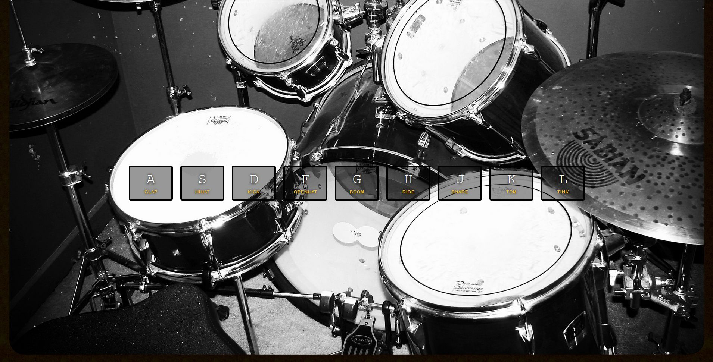

# JavaScript30 Challenge 01 - Interactive Drums
This simple website enables users to play drum sounds using 9 buttons on their keyboard.

## Lessons learned
Wes wastes no time and really throws viewers off the deep end with the first challenge. I expected something a bit more basic but this challenge is anything but.

As you can imagine, this can lead to a bit of frustration, especially since I was not aware that to download files off of GitHub, you needed to click on each individual one and get the Raw version. I made a mistake and just right-clicked each `.wav` file in the official repo and saved them to my local folder. I panicked as the resulting files weren't played by the browser. Of course they weren't played since they weren't valid files. After pouring over each line of code, trying to see where I had made a mistake, I tried to open the sound files in VLC. This lead me towards downloading the correct sounds and, lo and behold, everything was working.

I learned some good things about transitions and how you can manipulate them from JavaScript in CSS. While I wasn't that familiar with ES6 features, so far things aren't that difficult.

As a small customization, I changed the picture used by Wes into one with drums, to be more reflective of the actual content. Credits to [Mark Harrington](https://www.flickr.com/photos/c3kc_mark/).
