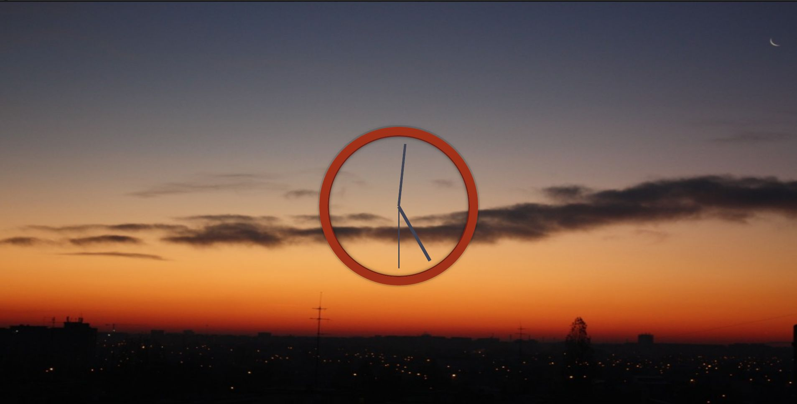

# JavaScript30 Challenge 02 - Analog clock
This simple website displays an analog clock over an elegant background.

## Lessons learned

>A warrior's greatest weapon ... is patience - Zenyatta from Overwatch

This one was a bit frustrating, although I am sensing a pattern that is more to do with my learning style than Wes' teaching style.

I typed most of the code following the example and I managed to create my own operations for getting the minutes and hour hands to move.

I tried quite hard to figure out a solution to remove the small glitch related to thee seconds hand when it reached the 12 o'clock position. The problem was that, instead of displaying a continued animation, the hand essentially turned counterclockwise until it reached the initial position. The problem with my solution was that I was fixated on the `secondsDegrees` value, trying to change the `transition` when it reached the value of 444. That didn't get me anywhere, and after wasting a bit of time, I decided to see the solutions of other participants in the course. The Eureka moment happened when glancing at [Amelieyeh's solution](https://github.com/amelieyeh/JS30/tree/master/02-JS%2BCSSClock). It turns out that I had to change the `transition` when it reached 90, instead of 444.

In terms of customization, I changed the picture used by Wes into one with a sunset taken by myself a very long time ago. I also swapped the white outline of the clock and the black hands with colors that are visible in the image. Credits to me :).
