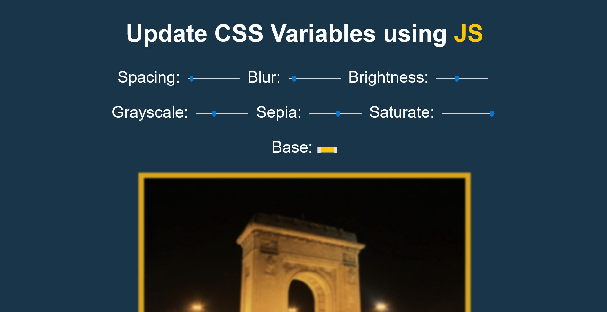

# JavaScript30 Challenge 03 - CSS Variables
This website enables users to edit a photo through CSS variables and filters.

## Lessons learned

After the first two lessons, this one was much easier, even if the results are a bit more impressive.

This was my first experience with CSS variables and, based on just this one foray, they seem pretty powerful when combined with JavaScript, although you do have to bear in mind the different suffixes needed for the values, from `px` to `%` and so on.

In terms of customization, I changed the picture used by Wes into one with the Arch of Triumph in Bucharest taken by myself a very long time ago. I also added a few other filter options for users to play with, based on the examples offered by [CSS Tricks](https://css-tricks.com/almanac/properties/f/filter/).
