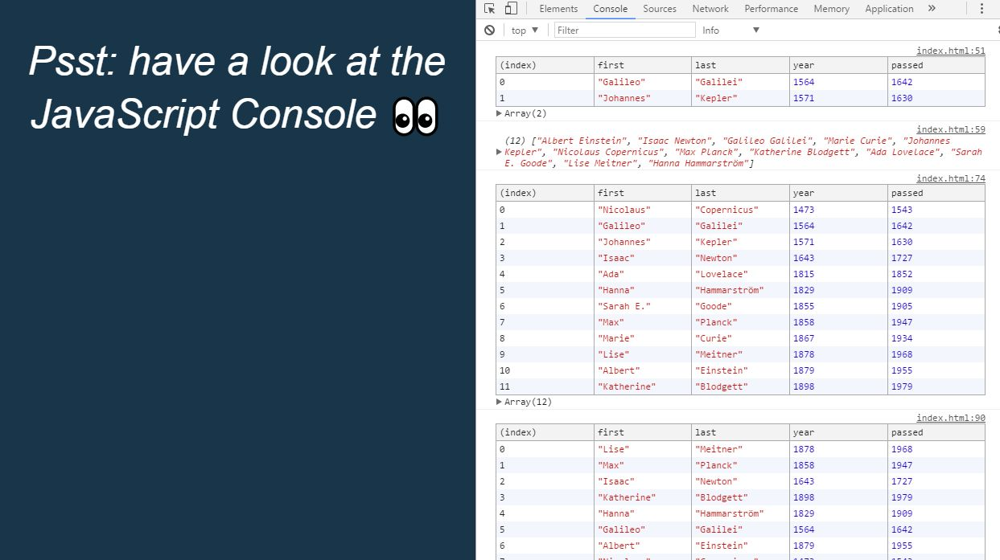

# JavaScript30 Challenge 04 - Arrays and methods in JS
Perform basic operations on JavaScript Arrays

## Lessons learned

I already had some experience with JavaScript arrays through FreeCodeCamp and I came into the lesson a bit better equipped. However, the introduction of the simplified ES6 syntax did take some time to master and comprehend.

While I can't say that I am now versed in the arts of JS Arrays and their methods, I intend to study a bit more and get a better feel of these constructs.
