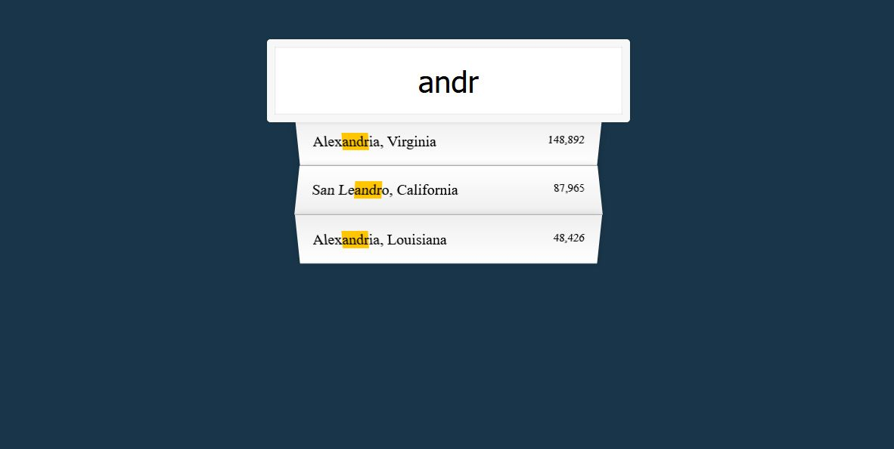

# JavaScript30 Challenge 06 - Type Filter
Filter through a JSON based on what is being typed

## Lessons learned

Working with JSON objects, even simple ones that contain basic arrays of data, has always seemed tricky to me, but with this course under my belt, things are a bit clearer. Manipulating the object to get the relevant data, filtering through it, mapping the results, and then displaying them in an easy to comprehend fashion is now much easier.

In terms of customization, I just changed the background color from that vibrant yellow to the cooler blue you can see in the screenshot. I plan on adding an option to sort the found cities by population or proximity, but I won't do that right now.
