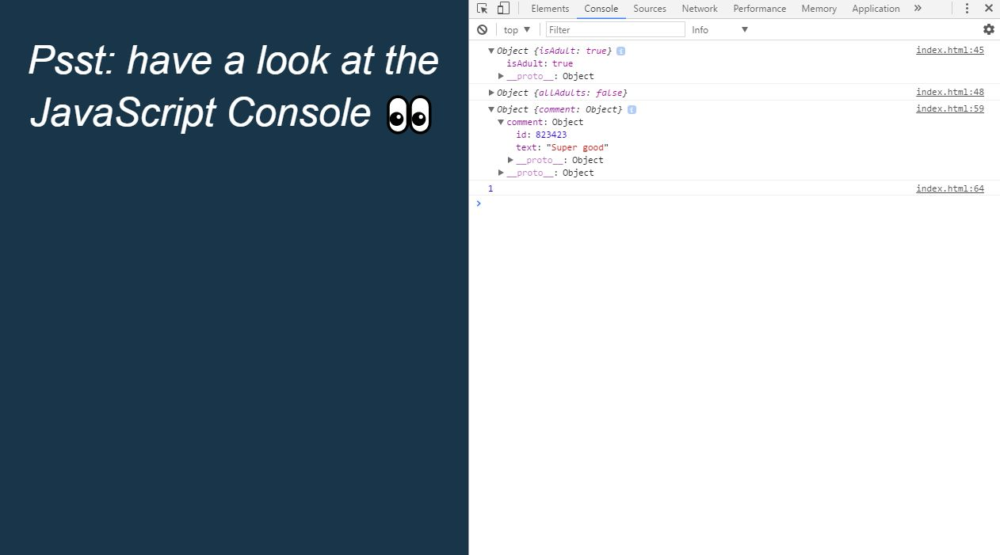

# JavaScript30 Challenge 07 - JS Arrays 02
Perform more operations on JavaScript Arrays

## Lessons learned

Things have progressed a bit smoother this time, as the operations weren't that complex and I already had some experience due to the previous exercises.

I also managed to write the arrow functions after the first one by myself, in order to test out my, for the moment limited, knowledge of arrow functions.

In terms of customization, I recreated the same background color and emoji from the previous [JS Array exercise](https://github.com/andreidbr/JS30/tree/master/04JSarray).
