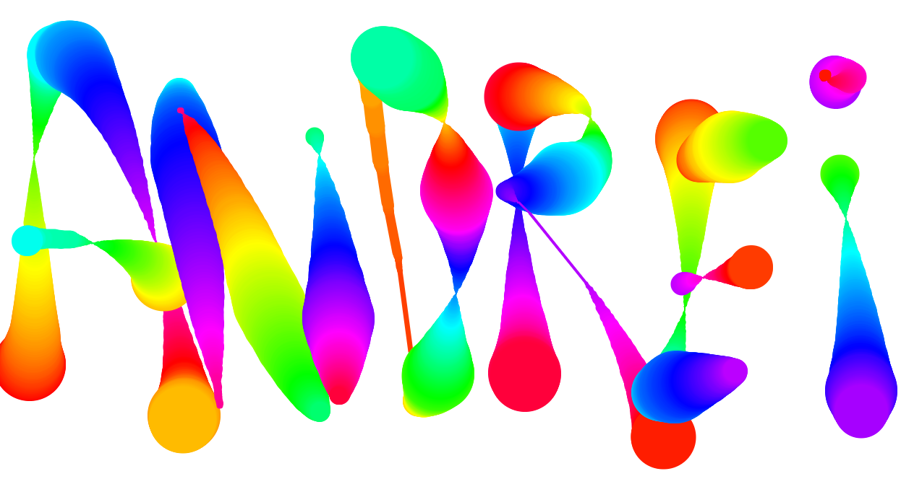

# JavaScript30 Challenge 08 - HTML5 Canvas
Have dynamic fun in a HTML5 Canvas

## Lessons learned

I already heard about the HTML5 Canvas but I didn't experiment with it until this exercise. I had a bit of fun seeing all the complex methods and functions the canvas comes with and the various ways through which Wes made sure that the behavior is as expected.

I did not know about HSL and now that I had some hands-on experience, I'll keep it in mind when I have to experiment with colors.

I didn't perform any customization on this project but there may be some potential with letting users tweak how fast the color or the width changes, thus changing the value they are incremented/decremented.
