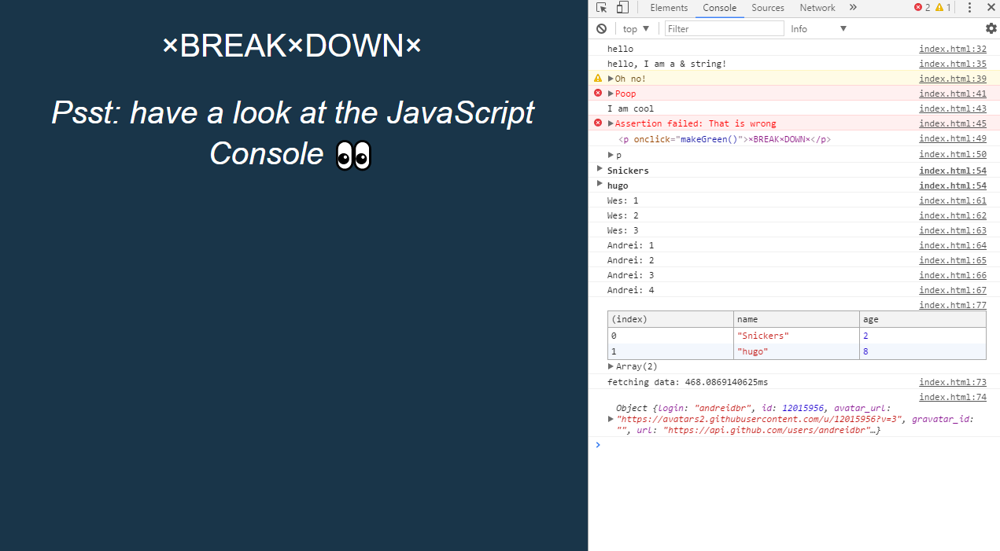

# JavaScript30 Challenge 09 - Dev Tools Tricks
Perform some nifty tricks using the dev tools

## Lessons learned

My past programming experiences involved languages like C++ or Java, so the shift to JavaScript and the lack of a full-fledged IDE with a dedicated console took some time to get used to. Fortunately, the dev tools included in Chrome or Firefox are pretty good, at least for my current needs.

This course from Wes, however, highlighted some pretty nifty things that are possible within those tools. By far the most impressive was the possibility of stepping into JavaScript functions to see how they change attributes and when.

I customized the code a bit and the visuals, so that they are in line with those from the JS Array sessions.
