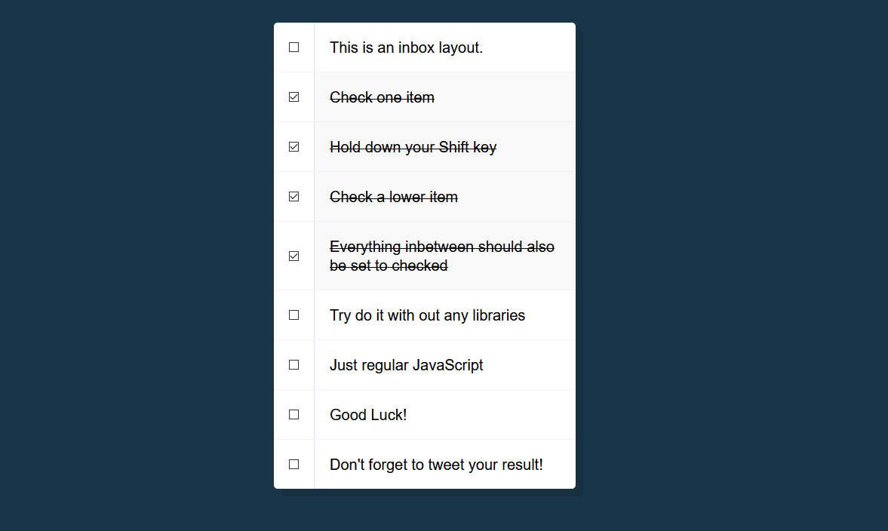

# JavaScript30 Challenge 10 - Shift and checkboxes
Select multiple checkboxes in succession by pressing the Shift key

## Lessons learned

This one was a bit tricky to wrap my head around as it involved manipulating the `this` aspect of JavaScript, which is still a bit vague for me. However, I plan on brushing up my skills and continuing to experiment with it.

I tried to do things on my own but it eventually didn't pan out and, seeing as how time was of the essence, I followed Wes' example from the video.