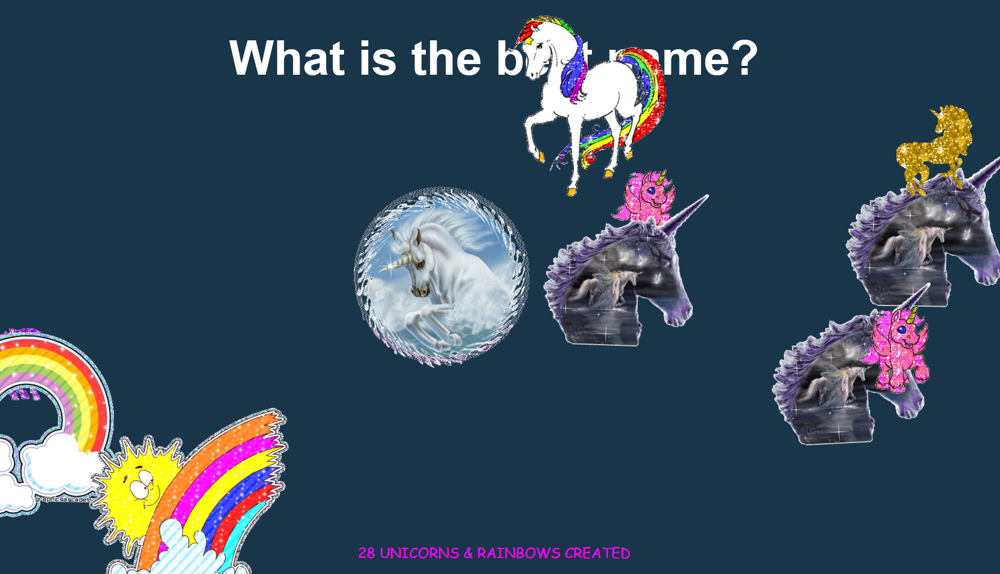

# JavaScript30 Challenge 12 - Sequence detector
Detect a sequence of keys, like the Konami Code, using JS

## Lessons learned

After the relatively frustrating previous exercise, this one did wonders in lifting my spirit. I always enjoy it when a website reacts in an interesting fashion when you input the Konami code or any other special key sequence.

As such, with this effort, I took Wes' example and tweaked it so that when users enter `andrei` the `cornify.js` library springs into action.