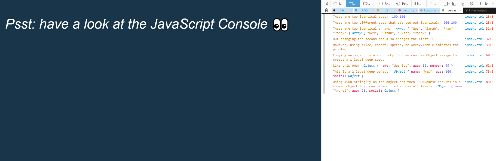

# JavaScript30 Challenge 14 - JavaScript Reference and Copy
Understand the difference between references and copies in JavaScript

## Lessons learned

JavaScript can be a pretty tricky language and this exercise, which explains the difference between copies and references is a perfect example. While numbers or strings can be attributed to new variables, thereby resulting in copies, Arrays and Objects result in references.

I added some extra explanations in the JS Console about the things that are logged into it, for added clarity.