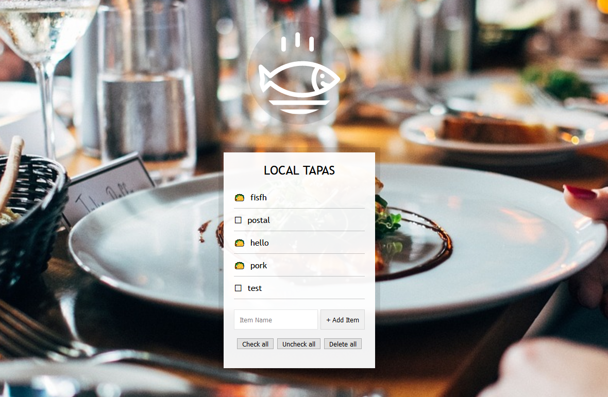

# JavaScript30 Challenge 15 - Local Storage
Use local storage to persist a list

## Lessons learned

This was my first foray into the local storage aspect of web development and Wes' exercise made it look pretty easy. I elarned quite a bit about persisting elements for the benefit of the user and I've even hit my head a bit against the wall, trying to make the Check all, Uncheck all, and Delete all buttons work.

So far, they do not, but I plan on revisiting this exercise in the near future and tackle the TODOs.