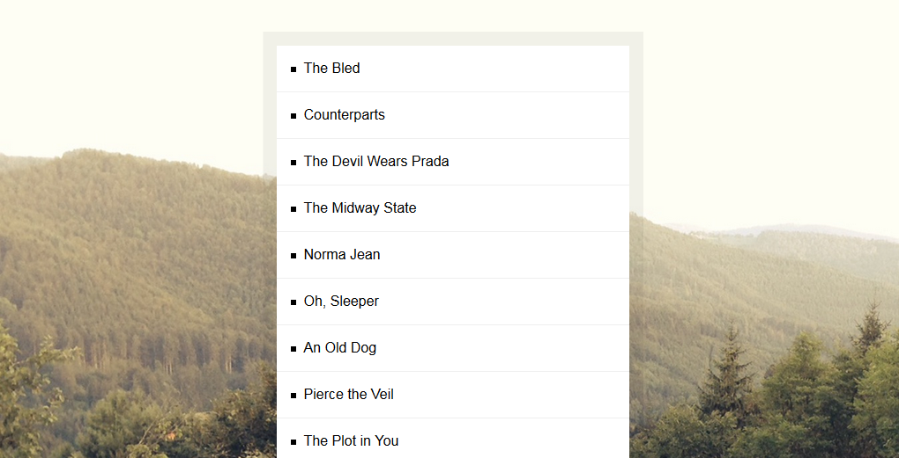

# JavaScript30 Challenge 17 - Sort and ignore articles
Sort an array alphabetically and ignore any articles 

## Lessons learned

From what I understood online, sorting is a task that gets tested in a lot of different ways during a programming interview, so it was interesting to see how Wes approached developing a sort algorithm that ignores any possible articles.

The solution, in hindsight, seems trivial, but I started trying out all sorts of complex operations and see what I came up with. Of course, I was not successfuly, but it did provide a learning experience.