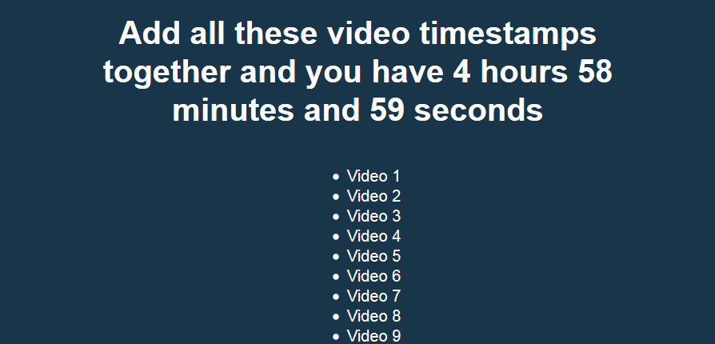

# JavaScript30 Challenge 18 - Adding up with Reduce
Add up timestamps with reduce

## Lessons learned

JavaScript has a lot of nifty functions that can help when manipulating data and map + reduce are a great example.

In this exercise, Wes goes through the two methods and also shows how you can ensure that manipulating hours, minutes, and seconds can go off without a hitch. I also liked the short explanation of `%` and how it helps in dealing with remaining sums.

As a short bit of customization, besides changing the background, I added an `h1` tag to display the total that gets calculated by all the JavaScript code.