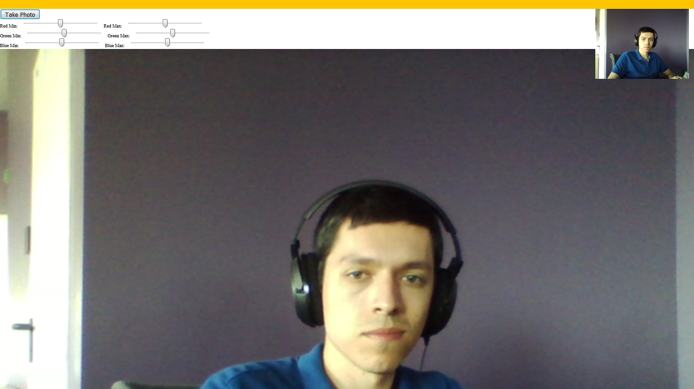

# JavaScript30 Challenge 19 - Webcam Manipulation
Capture the feed from a webcam and manipulate it in different ways

## Lessons learned

I think I say this on most of the exercises in Wes' course but this one was a lot of fun.

I had no idea that you can easily capture, render, and manipulate the feed from a webcam using JavaScript and Canvas. What's more, Wes gives you a thorough look into how such a feed can be manipulated in clear and concise ways.

I plan on adding new filters and probably allowing users to pick their own options, but that is a fight for another day.

Also, yes, that is my face :D