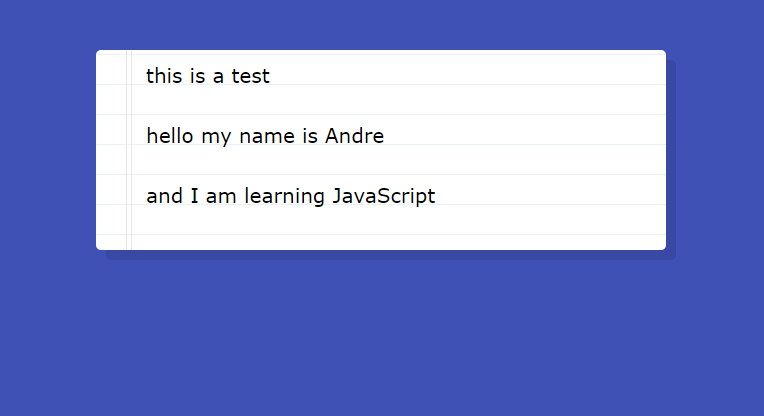

# JavaScript30 Challenge 20 - Speech Recognition
Recognize speech and display the text in a page

## Lessons learned

After thinking that the last exercise, with the webcam manipulation, was fun, this new one blows me away by showing the sheer versatility built into JavaScript.

Wes' instructions are pretty detailed and show that doing a task that seems lofty, recognizing the speech of a person and displaying it on a page, is actually pretty straightforward, provided you are a nimble manipulator of the various elements and outputs produced by the browser.

I plan on making a few enhancements in the very near future, probably to add some extra functions and features.