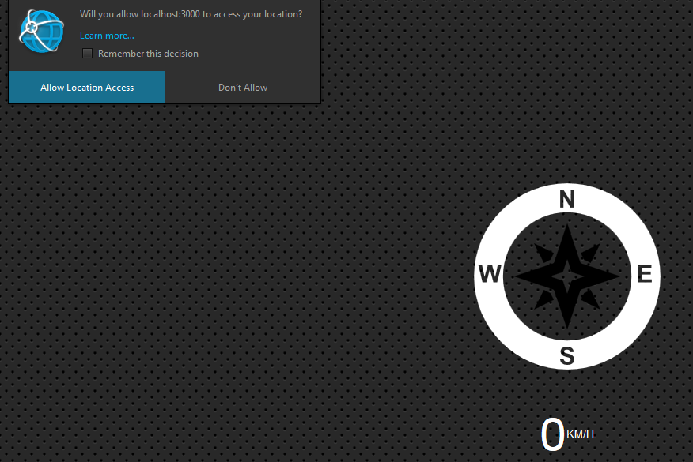

# JavaScript30 Challenge 21 - Get geolocation
Get the speed and direction of a user and display them with a compass

## Lessons learned

This exercise was pretty short but the lessons might come in handy in the future, whether or not other external libraries are used.

By far the most interesting thing is not actually the JavaScript for the geolocation feature, but more the CSS styling employed by Wes to make the page stand out. I'll probably go through it line by line and see what everything does.