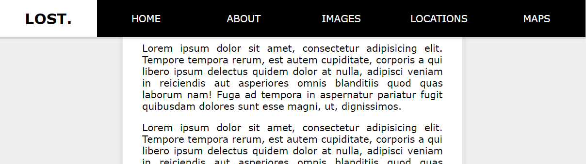

# JavaScript30 Challenge 24 - Sticky Nav Bar
Fix the nav bar once users have scrolled past its initial location

## Lessons learned

Sticky navigation bars are quite easy to do thanks to frameworks or libraries like Bootstrap but this example focused on plain old JavaScript and shined a light on some of the things to take into consideration when fixing elements on a page.

I really liked the animated transition used for the logo, which makes it stand out from other, regular sticky navigation bars.