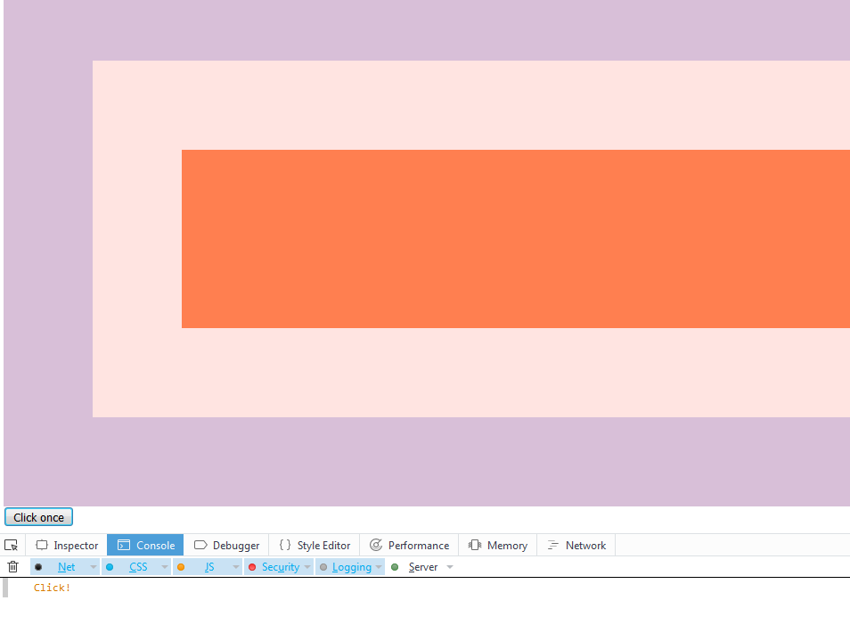

# JavaScript30 Challenge 25 - JavaScript Capture rules
Learn some rules about JavaScript's capture and bubbling

## Lessons learned

This exercise was pretty intriguing as I was not aware of the rules that govern JavaScript's event listeners. Knowing these things will enable me to better judge edge cases and ensure that, no matter the interface, the event listeners will behave as expected.

No customization just yet but maybe the whole exercise can be made a bit more interactive in the future.