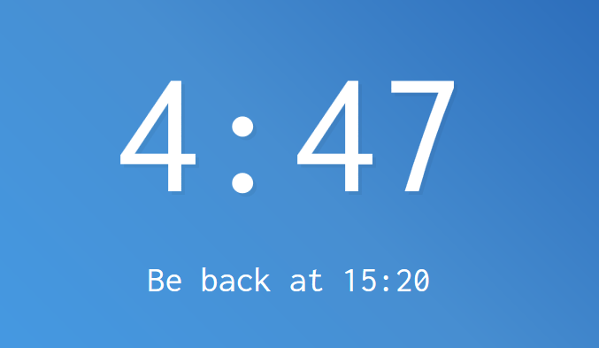

# JavaScript30 Challenge 29 - Countdown timer
Display a countdown timer and enable quick breaks

## Lessons learned

This exercise was pretty nifty as it goes a bit in depth about the date and time capabilities of JavaScript, while producing something extremely useful for real-life scenarios.

I may combine this with the clock one made way back in exercise 2, but further experimentation is required.