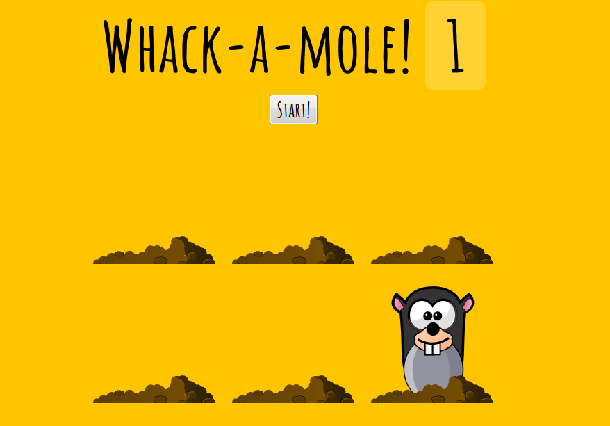

# JavaScript30 Challenge 30 - Whack a mole
Play the classic Whack A Mole game

## Lessons learned

The final exercise in JavaScript30 was certainly a fun one, as a "simple" experience like Whack A Mole requires a lot of planning and code to ensure it delivers the intended experience.

Wes goes through all sorts of important things and, shows how you can take into account everything, from the random timings and holes, to the scoring and start/stop.

I added a bit of customization to the start button, centering it, making it bigger, and using the same font as the title of the game.